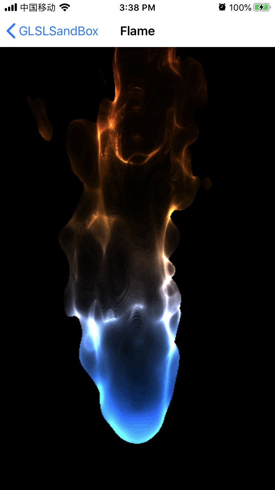
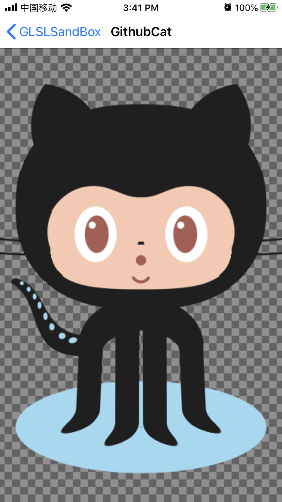

# glslsandbox-ios

## Overview
Native iOS implementation of [glslsandbox](http://glslsandbox.com/), using [GPUImage](https://github.com/BradLarson/GPUImage).

You can run most Fragment Shader copied from [glslsandox](http://glslsandbox.com/) or [ShaderToy](https://www.shadertoy.com/) without modification or just a little modification.

## Add new Fragment Shader
1. copy fragment shader source code from [glslsandbox](http://glslsandbox.com/)
2. create a new fragment shader source file under FragmentShader folder, then past code copied from last step. If you copy shader from [ShaderToy](https://www.shadertoy.com/), you need to modify the file.
   ```c
    // add below lines
    uniform float time;
    uniform vec3 mouse;
    uniform vec2 resolution;
    // shadertoy emulation
    #define iTime time
    #define iResolution resolution
    #define iMouse mouse
   ```
3. in ***GLSLSandboxListViewController.m*** file, add the fragment shader source file name to the `sandboxDemosList`.
4. run the project you will find the new demo in the demo list.

## Demo Snapshot
<p float="left">
   
   
   
</p>
